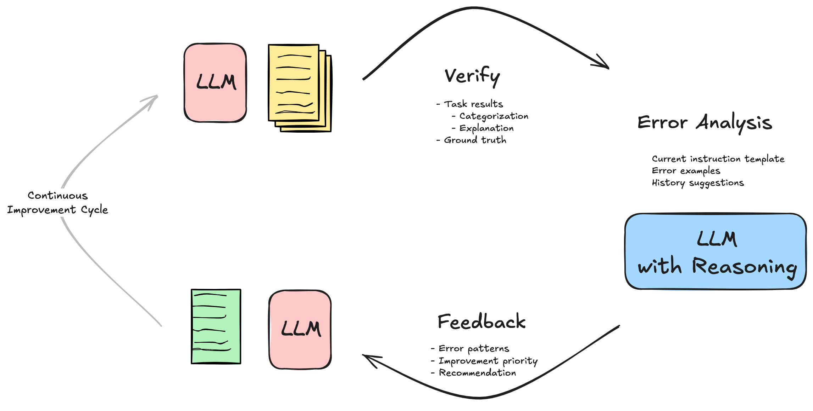
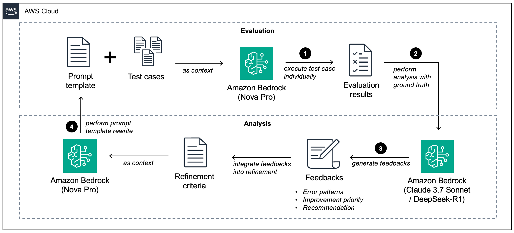

# Optimizing Prompt Efficiency with LLM Reasoning and Feedback

A feedback-driven optimization framework that leverages Large Language Model (LLM) reasoning capabilities to systematically improve prompt engineering for enterprise applications.

  

## Key Features

✅ **Feedback-Driven Optimization**  
Implements cutting-edge concepts from research papers like CRITIC and Reflexion in a production-ready framework

✅ **Systematic Error Analysis**  
Utilizes dedicated reasoning models to identify root causes and patterns in LLM performance failures

✅ **Structured Improvement Cycle**  
Implements a robust 5-stage process from task definition to continuous refinement


✅ **Modular Architecture**  
Supports flexible integration with different LLMs and custom feedback mechanisms

## How It Works



Our framework follows a systematic approach to optimize LLM performance:

- **Initial Setup**
   - Define task objectives and success criteria
   - Create prompt templates with clear instructions
   - Assemble evaluation datasets with ground truth labels

- **Point 1: Performance Assessment**
   - Test against ground truth data
   - Collect quantitative metrics and qualitative insights
   - Analyze misclassifications and decision explanations

- **Point 2 & 3: Error Analysis**
   - Examine model explanations using structured reasoning
   - Identify root causes and systemic issues
   - Generate specific, actionable feedback

- **Point 4: Prompt Refinement**
   - Implement targeted modifications based on reasoning feedback
   - Enhance instruction clarity and structure
   - Focus on improving the instruction layer

- **Continuous Improvement**
   - Test refined prompts against evaluation data
   - Measure performance improvements
   - Incorporate successful changes and iterate

You can reference the [notebook](./illustration_notebook_optimization_prompt.ipynb) for step-by-step execution.

## Getting Started

### Prerequisites

- Python 3.8+
- AWS account with Amazon Bedrock access
- Access to required foundation models (Amazon Nova, DeepSeek-R1, Sonnet3.7)

### Installation and Execution

```bash
cd prompt-optimization-with-reasoning-feedback
pip install -r requirements.txt
python3 main.py
```


### Example: Financial Services Classification Improvement

Here's an example of prompt refinement from our iteration logs:

```markdown
===== IMPROVED TEMPLATE =====
You are a Financial Services Assistant. Classify each customer inquiry into EXACTLY ONE of these categories:

ACKNOWLEDGMENT - For simple greetings and expressions of thanks only
PASSWORD_RESET - For issues accessing online accounts due to forgotten passwords or login problems
CONTACT_INFO_UPDATE - For updating email, phone number, address, or other personal information
PIN_RESET - For issues with PIN numbers for cards, including requests for changes or forgotten PINs
TRANSACTION_STATUS - For questions about specific pending transactions or transfers that have been initiated
AUTHENTICATION_SETUP - For setting up or troubleshooting security features like fingerprint access, face ID, etc.
CARD_DISPUTE - ONLY for unauthorized charges or fraudulent transactions the customer did not initiate
ESCALATION - For security breaches, account compromise, urgent time-sensitive issues, complex problems requiring manager intervention, or situations involving deceased account holders
IN_SCOPE - For general financial services questions that don't fit other categories, including account fees, product information, and service requests
OUT_OF_SCOPE - For topics completely unrelated to banking or financial services

### Classification Priority Rules:
1. If the inquiry involves ANY security concern or account compromise, classify as ESCALATION
2. If the inquiry involves multiple issues, classify based on the most urgent/critical issue
3. If the customer expresses urgency or dissatisfaction requiring manager attention, classify as ESCALATION
4. Only use IN_SCOPE when the inquiry relates to financial services but doesn't fit any specific category
```

This refined template improved classification accuracy from 60% to 76% in just one iteration.

### Performance Improvement Over Iterations

The framework demonstrates consistent performance improvements through iterative refinement. Here's the progression of our financial services classification task over 5 iterations:

| Iteration | Success Rate | Key Improvements |
|-----------|--------------|------------------|
| 1         | 60%          | Initial baseline template with basic category definitions |
| 2         | 76% (+16%)   | Added detailed escalation criteria and multi-issue handling rules |
| 3         | 84% (+8%)    | Enhanced fraud detection rules and added clarification examples |
| 4         | 92% (+8%)    | Introduced verification failure scenarios and time-sensitive criteria |
| 5         | 100% (+8%)   | Finalized fraud evidence definitions and output format requirements |

You can see the [full iteration logs](./iteration_log) for detailed progress tracking.

## Use Cases

This framework is particularly effective for:

- Optimizing enterprise chatbots for complex customer service scenarios
- Improving LLM performance on domain-specific tasks
- Enhancing content moderation and policy enforcement


## Security

See [CONTRIBUTING](CONTRIBUTING.md#security-issue-notifications) for more information.

## License

This library is licensed under the MIT-0 License. See the LICENSE file.

